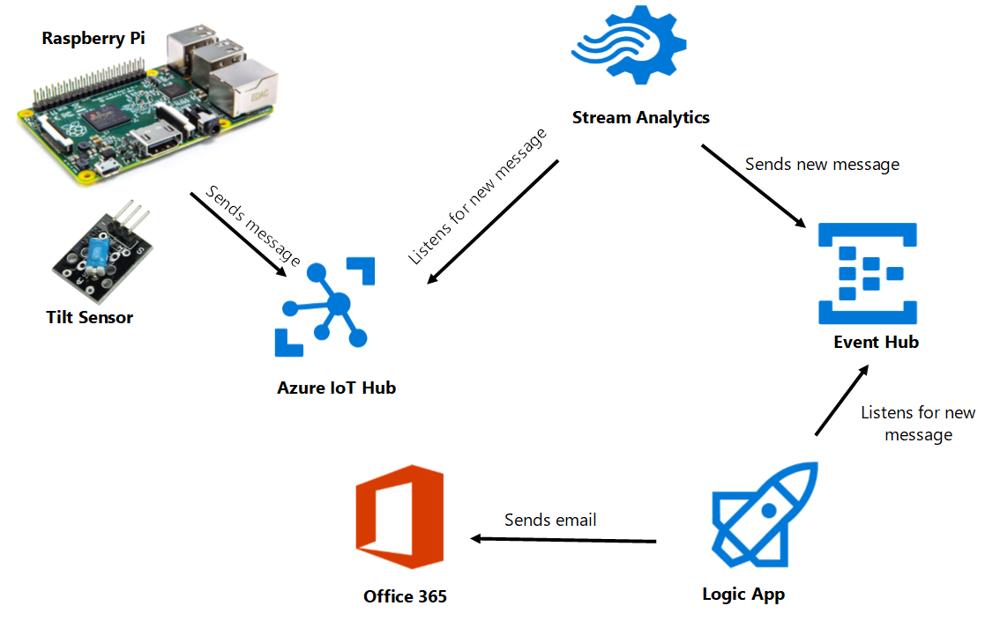
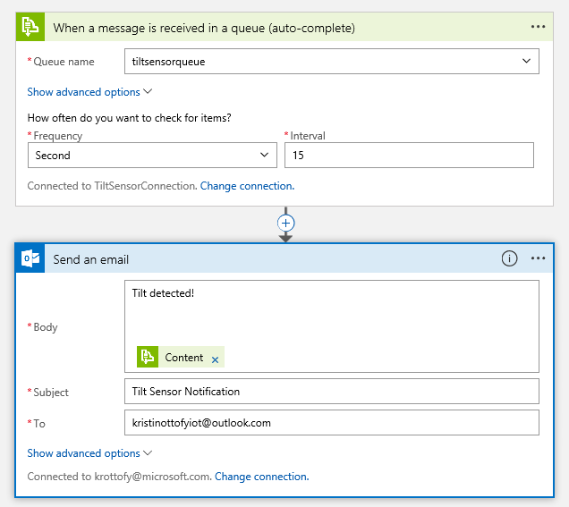

# Tilt Sensor Project

## Description
IoT Raspberry Pi project built on Microsoft IoT Core platform in Visual Studio Community 2015 using a tilt sensor and LEDs. One LED lights up based on if the tilt sensor senses tilt (on if yes, off if no). Another LED lights up periodically to signify a check if there is tilting or not. If at those checks the tilt sensor is tilting, then that will be recorded as a tilt. After a certain number of tilts, the third LED will light up to signal a notification is being sent to Azure Event Hub.

## Azure Setup


1. [Create the IoT Hub](https://docs.microsoft.com/en-us/azure/iot-hub/iot-hub-create-through-portal)
2. [Create Service Bus Queue](https://docs.microsoft.com/en-us/azure/service-bus-messaging/service-bus-dotnet-get-started-with-queues)
3. [Create a Stream Analytics Job](https://docs.microsoft.com/en-us/azure/stream-analytics/stream-analytics-create-a-job) with input from the IoT Hub and output to the queue with the query 
    ```sql
    SELECT
        *
    INTO
        [tiltsensoroutput]
    FROM
        [tiltsensorinput]
    WHERE
        IotHub.ConnectionDeviceId LIKE 'TiltSensor'
    ```
4. Create a Logic App to trigger on new message in the queue and send to email, SMS with twilio, or to do whatever you'd like!



## Steps to Run This Project
1. Download all of the files in the repository
2. Open the solution in Visual Studio
3. Update the local_settings.cs file with your device connection string and save it
4. Change the run mode in Visual Studio to Remote Machine
5. Update the IP Address of the Remote Connection
    * (Option A). If the Remote Connection window appeared after step 4, update the IP address with your IoT device IP address 
    * (Option B) Otherwise, double click on Properties in the Solution Explorer and update the Debug section with your IoT device's IP address
6. Nuget packages may need to be restored and project may need to be built or rebuilt and few times.
7. Run the project on the Remote Machine

## Loading This Project as Startup on Device
1. Follow the instructions [here](https://ms-iot.github.io/content/en-US/win10/samples/PowerShell.htm) to begin a PowerShell connection to the device (have patience here)
2. Use the commands [here](https://ms-iot.github.io/content/en-US/win10/tools/CommandLineUtils.htm) to set the startup project
    * For this project, you will need to find the name of the project after it has been deployed to the device by using `IotStartup list headless`
    * Then, use the command `IotStartup startup headless [Task1]` and paste in the name of the project for `[Task1`]

